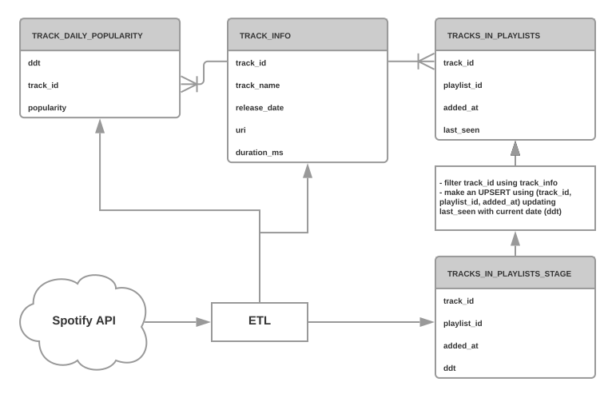

## Spotify Track Popularity ETL
### How to start
1. Build docker image
``` shell
$ ./build_docker_image.sh
```
2. Start docker container
``` shell
$ docker run -it stp-etl resources/config.yaml <client id> <client secret>
```

### Solution description
This implementation supports running multiple instances to distibute workload in case of large number of track ids. This can be achived by specifing different batch numbers in the config file:
``` yaml
batch_number: 1 	# worker number
batch_size: 1000	# number of track ids to process
```

NOTE:
Current implementation uses Sqlite as a database which doesn't support concurrent writes. Each instance will write data to its own database file. In real production scenario database server with concurrent writes support would be used.

There is an assumption that the process will not run longer then an hour so token refresh is not implemented for simplicity.

The solution is configurable to run with different API endpoints and database schemas without code changes. It can be achived by specifing endpoint and list of tables with column mapping towards API response fields:
``` yaml
tracks_url: 'https://api.spotify.com/v1/tracks/?ids='
tables:
  - table_name: track_info
    columns:
      - 'track_id:id:text'	# format: <column name>:<response field>:<column type>
      - 'track_name:name:text'
      - 'release_date:album.release_date:date'
      - 'uri:uri:text'
      - 'duration_ms:duration_ms:integer'
```

## Data Model solution



`TRACK_INFO` table is updated daily with the new tracks or if any of the track metadata has changed
`TRACK_DAILY_POPULARITY` table is updated daily by adding new rows for each track with popularity value for this day
`TRACKS_IN_PLAYLIST_STAGE` table is reloaded daily with data for every playlist from the input
`TRACKS_IN_PLAYLIST` table is updated daily by data processing job which filters stage table by track ids from `TRACK_INFO` table and updates `
last_seen` column for existing entries or inserts new rows.

### SQL queries
1. What tracks have been in a playlist during a specific time period.
``` sql
select distinct track_id from tracks_in_playlists where playlist_id = <"playlist_id"> and added_at <= end_date and last_seen >= start_date;
```
2. In which playlists a given track has been and during what periods of time.
``` sql
select playlist_id, added_at, last_seen from tracks_in_playlists where track_id = <"track_id">; 
```
